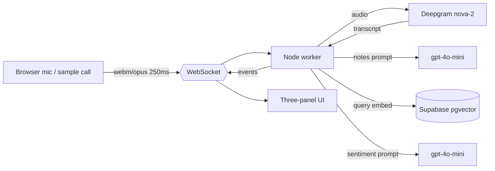

# Live Call Copilot

A public, real-time **agent-assist** demo: talk into your mic (or play a sample
call) and watch, live —

1. a **streaming transcript** (Deepgram `nova-2`),
2. **call notes** that draft themselves as the conversation unfolds (LLM),
3. **procedure docs** retrieved mid-call via **RAG** over pgvector,
4. a **sentiment meter** with a **sub-second frustration alert** (measured latency shown on screen).

It's a public re-build of a real-time agent-assist system I built at Capital One.

**Live demo:** https://agentassistdemo.harrisonjansma.com · **Write-up:** https://harrisonjansma.com

> "Acme Support" and all procedure docs are fictional sample data.

## Architecture



- **One WebSocket per session** carries both uplink audio and downlink JSON events.
- The worker fans each finalized utterance out to notes / RAG / sentiment in parallel, each with its own cadence + cost guards.
- UI updates arrive over the WS (not Supabase Realtime) — a single pipe, less infra.

## Monorepo layout

| Path | What |
|---|---|
| `apps/web` | Next.js 14 (App Router) + Tailwind — the three-panel UI |
| `apps/worker` | Node 20 + `ws` WebSocket server — ASR relay + LLM/RAG/sentiment orchestration |
| `packages/shared` | WS protocol types, LLM wrapper, Supabase client factory |
| `supabase/migrations` | schema + `match_docs` cosine search + RLS |
| `supabase/seed/docs` | the fictional procedure-doc corpus |

## Quickstart

```bash
pnpm install
cp .env.example .env          # fill in DEEPGRAM_API_KEY, OPENAI_API_KEY, SUPABASE_*
pnpm --filter @call-copilot/shared build

# apply DB schema (Supabase CLI, or run supabase/migrations/*.sql in order)
supabase db push

pnpm --filter @call-copilot/worker seed:dev   # embed + load the docs corpus (local, via tsx)
# in prod the compiled `pnpm --filter @call-copilot/worker seed` runs as a
# Railway pre-deploy step and is idempotent (skips if already seeded)

pnpm dev:worker               # ws://localhost:8080/ws  + GET /healthz
pnpm dev:web                  # http://localhost:3000
```

Set `NEXT_PUBLIC_WS_URL=ws://localhost:8080/ws` for local web dev.

## Environment variables

See [`.env.example`](./.env.example) and [`DEVELOPMENT_SPEC.md`](./DEVELOPMENT_SPEC.md) §3.

| Var | Scope | Notes |
|---|---|---|
| `DEEPGRAM_API_KEY` | worker | streaming ASR |
| `OPENAI_API_KEY` | worker | notes, sentiment, embeddings |
| `SUPABASE_URL`, `SUPABASE_SERVICE_ROLE_KEY` | worker | server-side DB (service role) |
| `PORT` | worker | injected by Railway |
| `NEXT_PUBLIC_WS_URL` | web | `wss://…/ws` of the worker |
| `NEXT_PUBLIC_SUPABASE_URL`, `NEXT_PUBLIC_SUPABASE_ANON_KEY` | web | read-only doc lookups |

## Deploy

Two Railway services (web + worker) from this monorepo; per-service build/start in
each app's `railway.json`. DNS on Cloudflare: `agentassistdemo.harrisonjansma.com`
→ web, `ws.agentassistdemo.harrisonjansma.com` → worker. Full steps in
[`DEVELOPMENT_SPEC.md`](./DEVELOPMENT_SPEC.md) §3.1.

## License

MIT © Harrison Jansma
